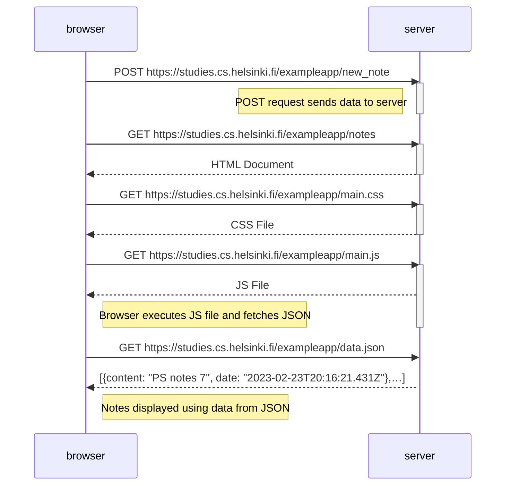

```mermaid
sequenceDiagram
	participant browser
	participant server

	browser->>server: POST https://studies.cs.helsinki.fi/exampleapp/new_note
	activate server
	Note left of server: POST request sends data to server 
	deactivate server

	browser->>server: GET https://studies.cs.helsinki.fi/exampleapp/notes
	activate server 
	server-->>browser: HTML Document
	deactivate server

	browser->>server: GET https://studies.cs.helsinki.fi/exampleapp/main.css
	activate server
	server-->>browser: CSS File
	deactivate server

	browser->>server: GET https://studies.cs.helsinki.fi/exampleapp/main.js
	activate server
	server-->>browser: JS File 
	Note right of browser: Browser executes JS file and fetches JSON 
	deactivate server

	browser->>server: GET https://studies.cs.helsinki.fi/exampleapp/data.json
	activate server
	server-->>browser: [{content: "PS notes 7", date: "2023-02-23T20:16:21.431Z"},…]
	Note right of browser: Notes displayed using data from JSON 
```