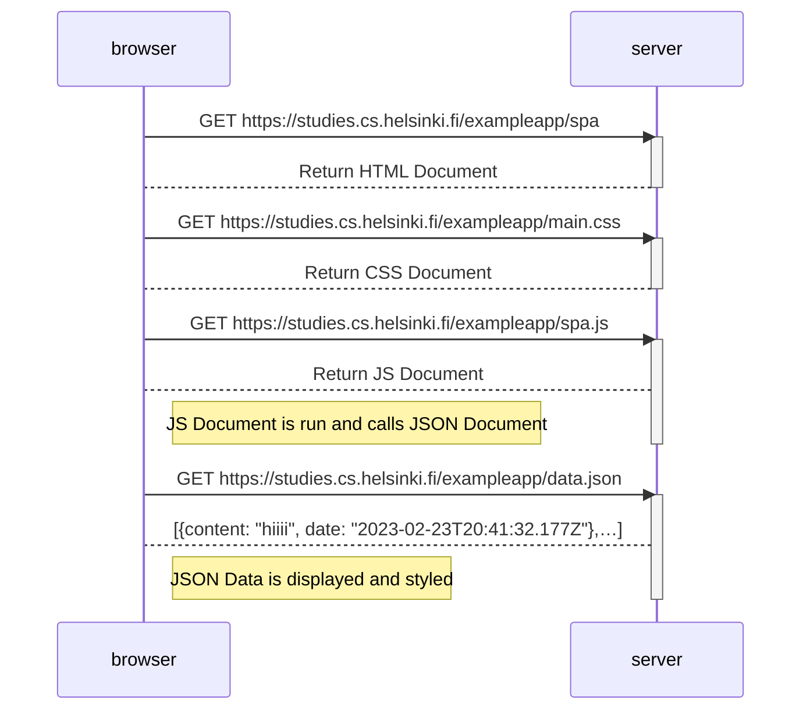

```mermaid
sequenceDiagram
	participant browser
	participant server

	browser->>server: GET https://studies.cs.helsinki.fi/exampleapp/spa
	activate server
	server-->browser: Return HTML Document
	deactivate server

	browser->>server: GET https://studies.cs.helsinki.fi/exampleapp/main.css
	activate server
	server-->browser: Return CSS Document
	deactivate server

	browser->>server: GET https://studies.cs.helsinki.fi/exampleapp/spa.js
	activate server
	server-->browser: Return JS Document 
	Note right of browser: JS Document is run and calls JSON Document 
	deactivate server

	browser->>server: GET https://studies.cs.helsinki.fi/exampleapp/data.json
	activate server
	server-->browser: [{content: "hiiii", date: "2023-02-23T20:41:32.177Z"},…]
	Note right of browser: JSON Data is displayed and styled 
	deactivate server 
```